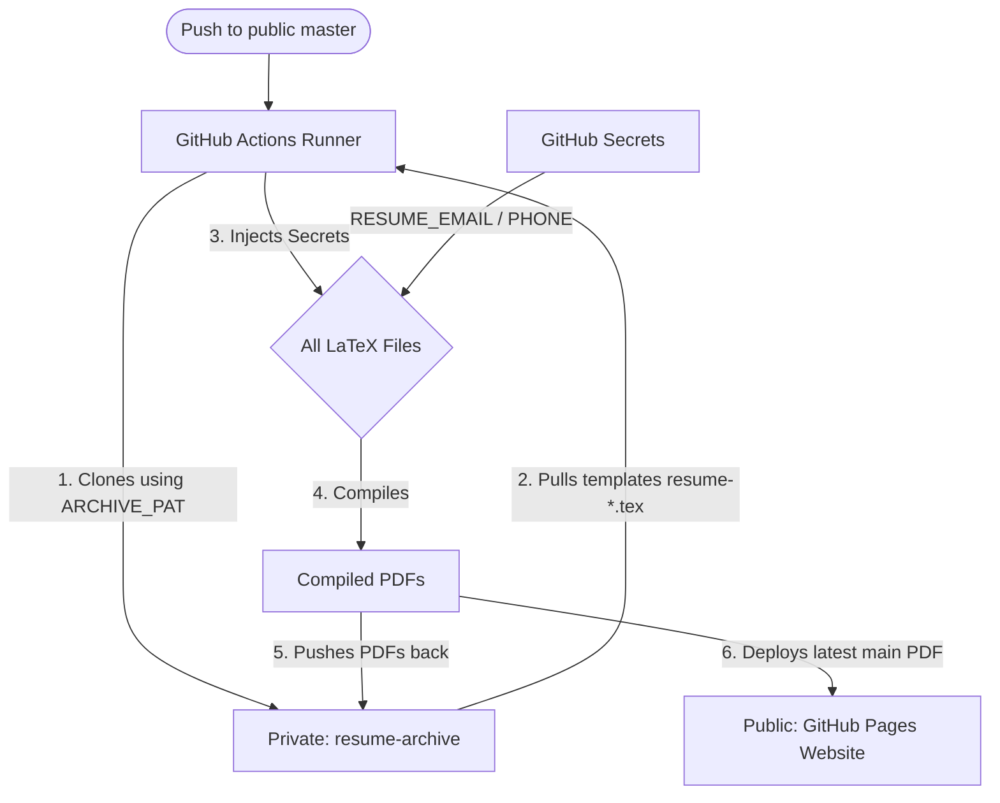

# Developer Guide for AI Agents & Developers

This repository is configured in a hybrid public/private architecture. It allows hosting a public LaTeX template and build codebase while securing personal contact information, private domain-specific resumes, and compiled PDF revisions.

---

## 1. Architecture Diagram



---

## 2. Repository Roles

### Public Repository (`BriskAM/resume`)
*   **Purpose**: Showcase clean, generic LaTeX code, automated compiling scripts, and host the landing page website.
*   **Key Files**:
    *   `resume.tex`: The main resume template (contains placeholders for contact details).
    *   `main.py`: Python compiler script that handles secrets injection and LaTeX compilation.
    *   `compile.sh` & `compile-private.sh`: Helper scripts for compiling main and private templates.
    *   `.github/workflows/pages.yml`: The CI/CD workflow that handles secrets replacement, pulls private templates, builds all PDFs, pushes them to the archive, and deploys the website.
*   **Privacy Constraint**: **NEVER** check in your real email address, phone numbers, or compiled PDF files. Keep the git history completely clean.

### Private Repository (`BriskAM/resume-archive`)
*   **Purpose**: Securely archive your actual compiled PDFs, dated revisions, and store private, job-specific templates.
*   **Key Files**:
    *   `resume-cisco.tex`, `resume-amazon.tex`, etc.: Domain-specific resume templates (containing contact placeholders).
    *   `akshit_mehta_resume_cisco.pdf`, `akshit_mehta_resume_amazon.pdf`, etc.: The latest compiled PDFs containing real contact details.
    *   `versions/`: A folder containing timestamped snapshots of previous main resume versions for backup purposes.

---

## 3. Secrets Configuration (Public Repository)

The public repository's CI/CD pipeline requires the following secrets under **Settings -> Secrets and variables -> Actions**:
*   `RESUME_EMAIL`: The email address injected into the PDF (e.g., `your.email@gmail.com`).
*   `RESUME_PHONE_DISPLAY`: The phone number displayed in text (e.g., `+91 9999999999`).
*   `RESUME_PHONE_LINK`: The phone number injected into the `tel:` hyperlink (e.g., `+91-9999999999`).
*   `ARCHIVE_PAT`: A Personal Access Token (PAT) with write permissions to `BriskAM/resume-archive` so the CI/CD pipeline can push compiled PDFs.

---

## 4. How to Manage Resumes

### Crucial Contact Placeholders
Every LaTeX template (`.tex` file) in both the public and private repositories **must** use these exact placeholder strings for contact details. The build engine looks for these exact strings to replace on-the-fly:
*   Email: `email@example.com`
*   Phone hyperlink: `+91-0000000000`
*   Phone text: `+91 0000000000`

---

### Updating the Main Resume (`resume.tex`)
1.  Modify `resume.tex` directly in the public repository.
2.  Commit and push to `master`.
3.  The public GitHub Actions runner will automatically build it, push the updated PDF with real contact details to your private archive, and update the PDF on your public website.

---

### Adding or Updating a Domain Resume (e.g., `resume-amazon.tex`)
Since domain-specific resumes are stored privately:
1.  **Clone the private archive**:
    ```bash
    git clone https://github.com/BriskAM/resume-archive.git
    ```
2.  **Add/Modify Template**:
    *   To add a new template, create a file named `resume-<domain>.tex` (e.g., `resume-amazon.tex`).
    *   Ensure all contact info matches the **Crucial Contact Placeholders** listed above.
3.  **Push changes to private archive**:
    *   Commit and push the new `.tex` file to `resume-archive`.
4.  **Trigger the Build**:
    *   Go to the public repository's **Actions** tab.
    *   Select the **"Build and publish resume"** workflow.
    *   Click **"Run workflow"** (manual trigger via `workflow_dispatch`).
    *   The runner will fetch the new template, compile it with your real contact details, and commit the compiled PDF (`akshit_mehta_resume_<domain>.pdf`) directly back to the private archive.

---

## 5. Local Compilation & Secrets Injection

To compile templates locally on your machine with your actual contact details, configure a local `.env` file (which is already configured in `.gitignore` to prevent committing it).

### Step 1: Configure Local Secrets
Create a `.env` file in the root of the public repository:
```env
RESUME_EMAIL=your.email@gmail.com
RESUME_PHONE_DISPLAY=+91 9999999999
RESUME_PHONE_LINK=+91-9999999999
```

### Step 2: Compile the Main Resume
Ensure you have a LaTeX engine installed (`pdflatex` or `tectonic`).
```bash
./compile.sh
```
This runs `main.py`, which loads your `.env` values, performs on-the-fly replacement of placeholders, compiles the PDF, and cleans up all temporary LaTeX helper files.

### Step 3: Compile a Domain Resume Locally
To pull, compile, and clean up a domain resume (e.g., `resume-amazon.tex`) in one step:
```bash
./compile-private.sh amazon
```
This helper script:
1.  Temporarily clones `BriskAM/resume-archive` to a local folder.
2.  Copies `resume-amazon.tex` into the workspace root.
3.  Deletes the cloned directory.
4.  Compiles the resume locally with your `.env` details.
5.  Cleans up the copied `.tex` template, leaving only the compiled `akshit_mehta_resume_amazon.pdf`.

---


